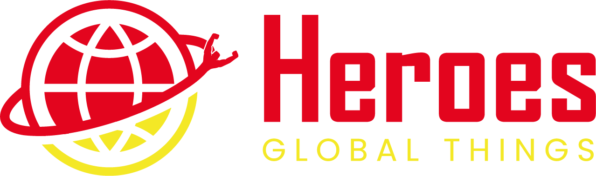

<h1 align="center" color="white"></h1>

<div align="center"></div>
<h2 align="center"><a color="white" href="https://heroes-globalthings.vercel.app">View Demo</a></h2>

## 📕 About

**Heroes Global Things** is an application build using NextJS with Typescript and TailwindCSS for styling. Using AXIOS from API Request for these features bellow.

## ⚙️ Features

- [x] Add a new Hero
- [x] Edit a Hero
- [x] Delete a Hero
- [x] Add a new Category
- [x] Delete a Category
- [x] Filter Heroes through Category
- [x] Pagination for Heroes

## Prerequisites

```bash
  #### Clone this repository
  $ git clone "https://github.com/uildez/heroes-globalthings"
```

```bash
  #### Install dependencies
  $ npm install
```

```bash
  #### Run the application in development mode
  $ npm run dev
```

## Authors
- [@uildev](https://www.github.com/uildev)

## Environment Variables
To run this project, you will need to add the following environment variables to your .env file
`NEXT_PUBLIC_ACESS_KEY`

## Technologies
The following tools were used in building the project:
- [Next JS](https://nextjs.org/docs/getting-started)
- [TypeScript](https://www.typescriptlang.org/)
- [React-Hook-Form](https://react-hook-form.com)
- [TailwindCSS](https://tailwindcss.com/docs/guides/vite)
- [Axios](https://axios-http.com/docs/intro)

## 🔗 Links
[](https://www.uildev.tech/)
[](https://www.linkedin.com/in/uildes-dem%C3%A9trio/?locale=en_US/)

## Feedback
If you have any feedback, please reach out to me at uildesdacosta@gmail.com or the links above!
